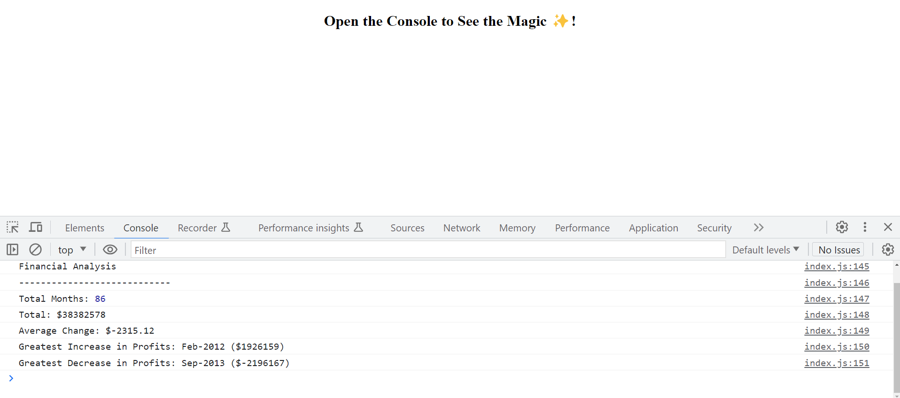

# JavaScript Fundamentals: Console Finances


## Description

Console Finances is a JavaScript application that allows you to manage your personal finances right from your console. With this application, you can keep track of your income, expenses, and view your overall financial status.


## Installation

. Clone the repository or download the project files.

. Open the project directory in your preferred console or code editor.
    
## Usage/Examples

. Open your console and navigate to the project directory.

. Run the index.html file or execute the index.js file using a JavaScript runtime environment.

. Follow the instructions displayed in the console to interact with the application.
Use the available commands to add income, add expenses, view transactions, and perform other operations as needed.
## Screenshots




## Lessons Learned

. I learned how to store and manipulate transaction data using arrays and objects.

. Iterate over an array using a for loop.

. I encountered and resolved various bugs and issues. This experience enhanced my debugging skills and taught me how to effectively troubleshoot JavaScript code using techniques like console logging, stepping through code, and using browser developer tools.

. I learned the importance of modular code organization. Breaking down the application into smaller, modular functions and files improved code readability.

. This project taught me the importance of project planning and time management.


## Credits

. The Console Finances application is inspired by the concept of personal finance management.

. Thanks to the contributors of the JavaScript community for their valuable libraries and resources.


## Demo

https://rinkal-m-patel.github.io/Financial_Analysis/


## Run Locally

Clone the project

```bash
  git clone https://link-to-project
```

Go to the project directory

```bash
  cd my-project
```

To open in visual studio

```bash
  code .
```


## License

Please refer to the LICENSE in the repo.

